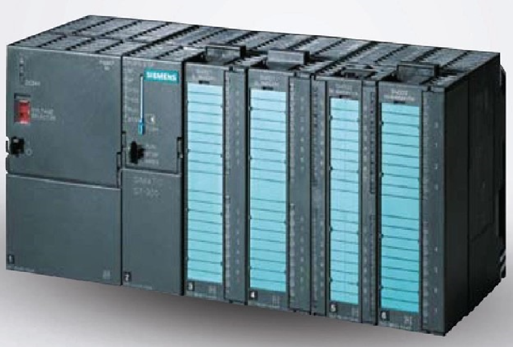
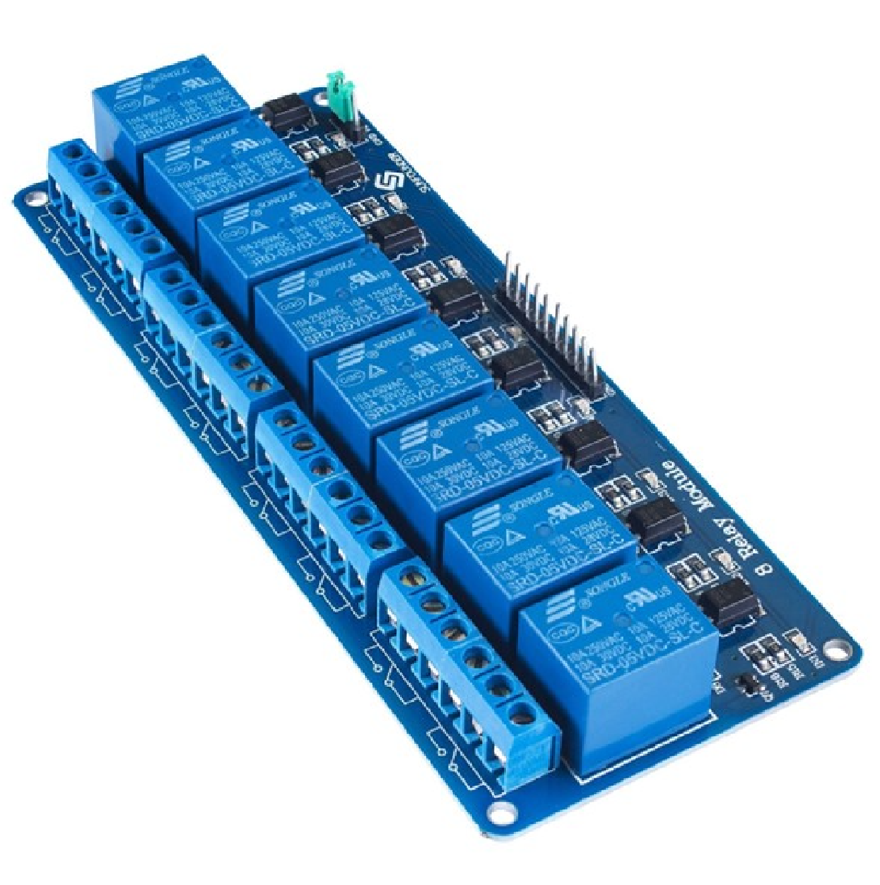
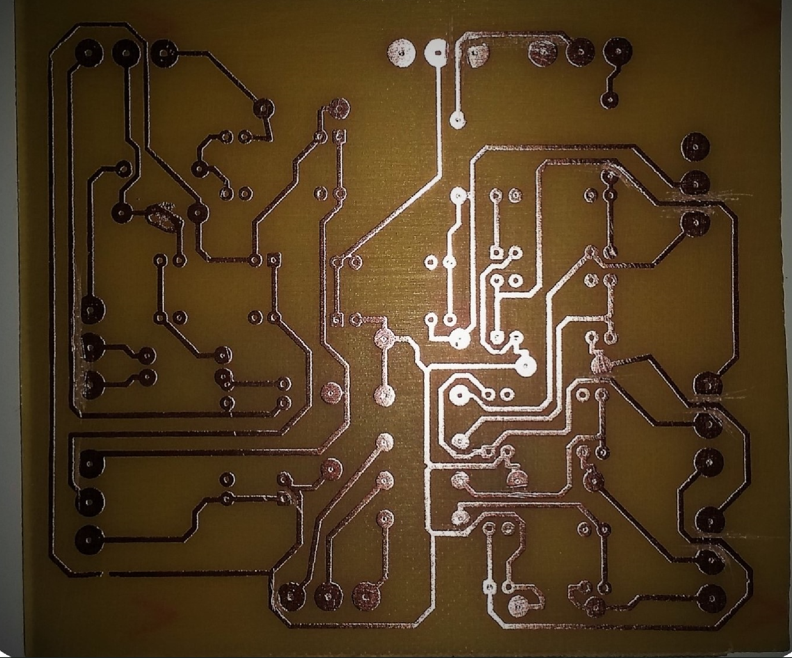
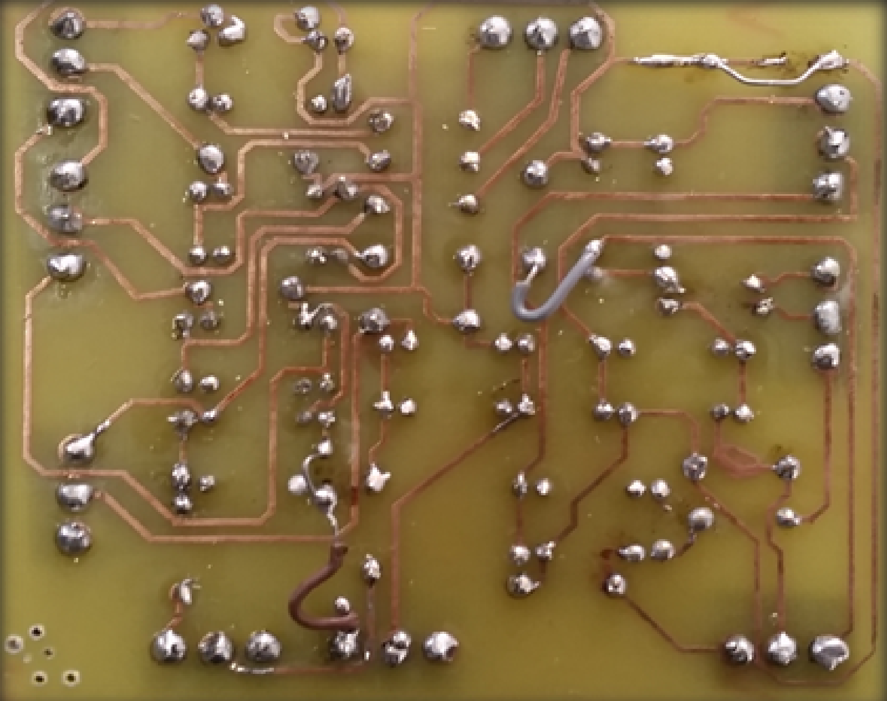
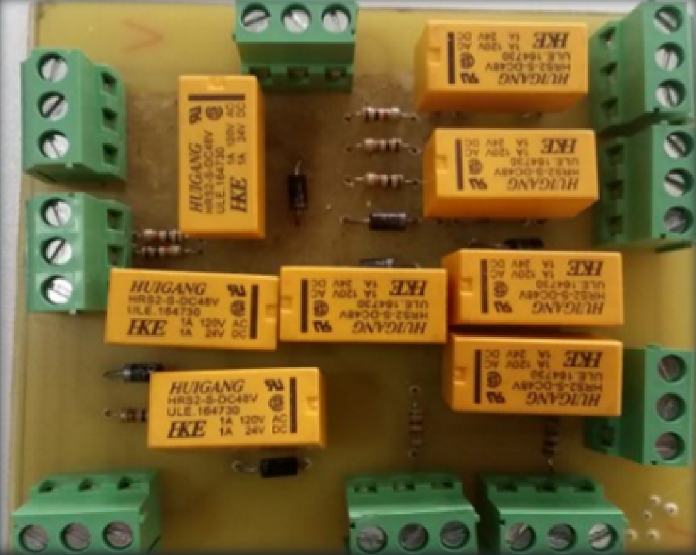
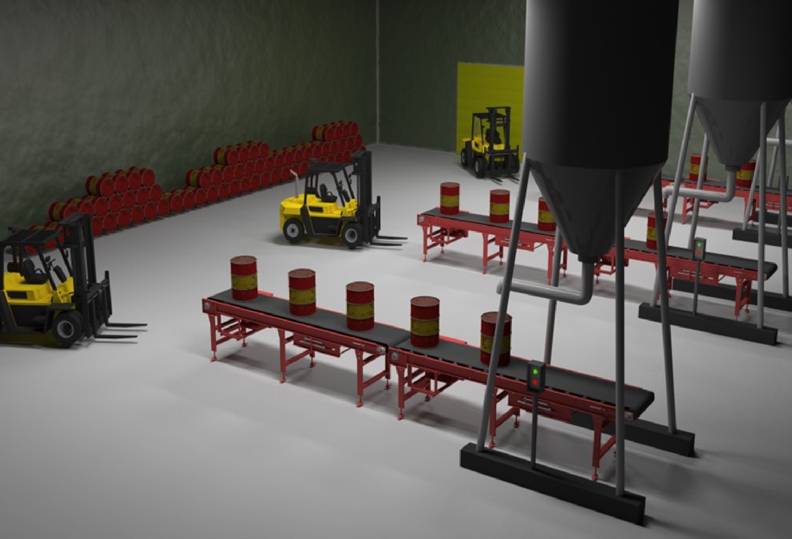
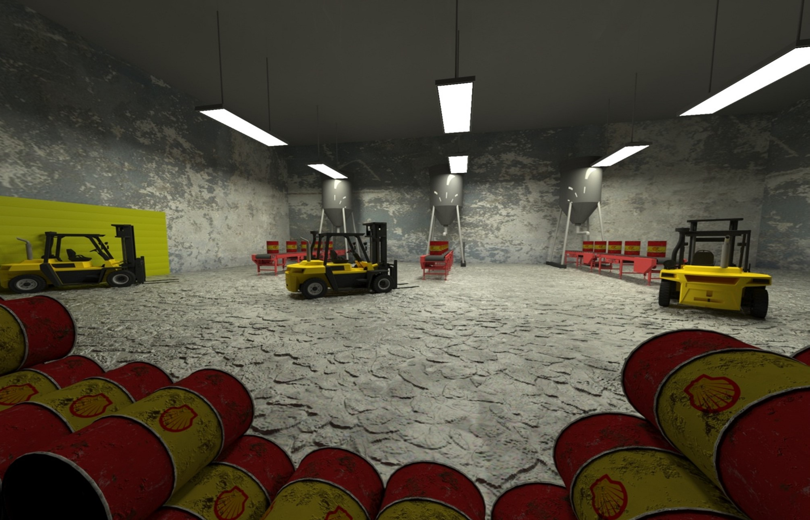
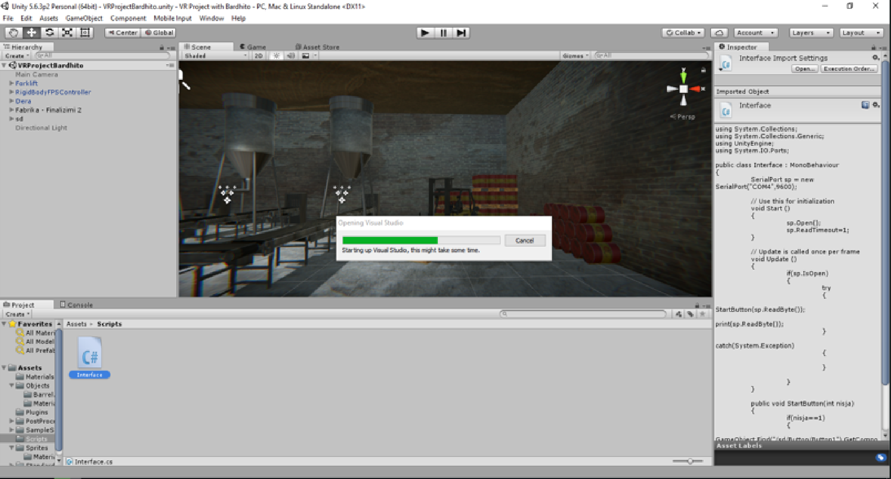

# Virtual Reality Industrial Factory

This project aims to develop a prototype system for Virtual Reality based on the Oculus Rift platform, which can be used to improve the skills of factory workers. The system will be evaluated through an experiment in which it must be assembled between Arduino-PLC-Oculus Rift.
Background

# Components
## PLC

PLC (Programmable Logic Controller) is an industrial computer control system that continuously monitors the state of input devices and makes decisions based on a custom program to control the state of output devices. PLC is a digital computer used to automate various electromechanical processes in the industry. These controllers are specially designed to survive in harsh situations and protected from heat, cold, dust and moisture, etc. PLCs are intended to be very flexible in the way they can be programmed, while also providing the advantages of high reliability (no mechanical failures), compactness and economy over traditional control systems. 

## Arduino

Arduino is an open-source electronics platform based on simple software and hardware. It is used to design and build electronic circuits and systems. The Arduino board can read input signals from sensors, buttons, switches, and other devices, and convert these signals into output signals to control motors, lights, and other devices. Arduino is commonly used in prototyping and DIY projects.

## Oculus Rift

Oculus Rift is a virtual reality headset developed and manufactured by Oculus VR. It features a high-quality display and precise head-tracking capabilities, allowing users to experience immersive virtual reality environments. The Oculus Rift is widely used in various industries, such as gaming, education, and research.

# Project Steps

The project involves the following steps:

    1. Develop the connection between PLC and Arduino (through driver).
        1.2 Connect PLC with relays. [Elec. Eng.]
 
        
        1.1 Develop PCB (Printed Circuit Board) for converting 24V -> 5V to use as Arduino input [Board-design].

        1.2 Connect relays with the developed PCB board. [Elec. Eng.]
  

    2. Design the factory using 3D modeling software. [3D Modeling, Autodesk 3D Max]
  
    
    3. Develop the Unity application for the factory (Oculus Rift). [C#, Unity, Photoshop]

    4. Develop code to connect Arduino with Unity. [C++, Arduino]

    5. Evaluate the system through an experiment in which it must be assembled between Arduino-PLC-Oculus Rift. []

